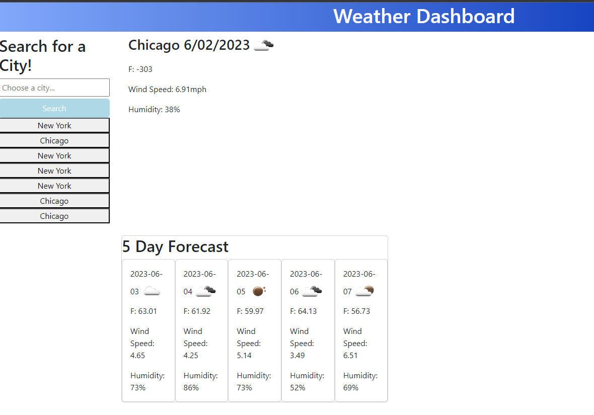

# Challenge 6 - Weather Dashboard

## Description
- Want a quick and easy way to get the current weather and the following 5 day forecast for a specific city? Check out the Weather Dashboard!
- You can easily search for a city in the US in the search bar where the current and following 5 day forecasts will display on the page for you. 
- Each forecast will outline the temperature, the weather conditions via an icon, humidity, and wind speed.
- After searching for a city, it will be saved in your local storage and displayed on screen for quick and easy access to search those forecasts again!

## Screenshot
- 

## Github Repo & Deploy Links
- Deploy Link: https://ikingspacely.github.io/challenge-6-weather-dashboard/

- Github Repo Link: https://github.com/iKingSpacely/challenge-6-weather-dashboard